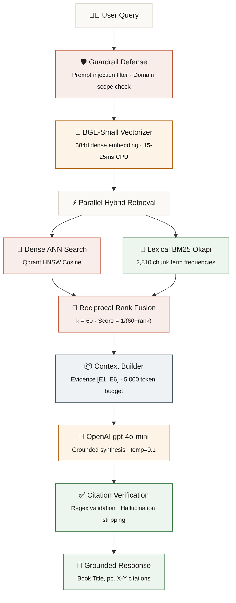

# TechBook RAG

[](https://www.python.org/downloads/)
[](https://fastapi.tiangolo.com)
[](https://qdrant.tech)
[](https://huggingface.co/BAAI/bge-small-en-v1.5)
[](https://openai.com)

**Intelligent Technical Knowledge Assistant** — Production-grade RAG over 11 technical books (2,810 chunks) using hybrid Dense + BM25 search with Reciprocal Rank Fusion.

🔗 **Quick Links:** [Live Interactive Architecture Showcase](https://rudra-p11.github.io/techbook-rag/) · [RRF k=60 Forensic Case Study](https://rudra-p11.github.io/techbook-rag/case_study_rrf_retrieval.html)

---


<br>

## Overview

TechBook RAG is a **production-grade, interview-ready** Retrieval-Augmented Generation system built over a curated library of **11 technical textbooks** spanning SQL, Python, Machine Learning, Deep Learning, Linear Algebra, and Software Engineering.

Every answer is grounded in real textbook passages with **verifiable page-level citations** — no hallucinations, no ungrounded claims.

<br>

> [!TIP]
> **Explore the full system interactively in your browser:**
> - [**Live Architecture Blueprint & Pipeline Simulator**](https://rudra-p11.github.io/techbook-rag/) — Interactive neural tokenizer, draggable 2D vector nebula, RRF physics sandbox, and 8-stage pipeline simulator
> - [**Empirical Case Study: RRF k=60 Retrieval Analysis**](https://rudra-p11.github.io/techbook-rag/case_study_rrf_retrieval.html) — Forensic analysis of hybrid retrieval for *"What is a forward pass in a neural network?"*

<br>

---

<br>

## Architecture

<br>



<br>

---

<br>

## System Specifications

<br>

<table>
  <tr>
    <td align="center" width="160"><br><kbd>&nbsp; Embeddings &nbsp;</kbd><br><br></td>
    <td><b>BAAI/bge-small-en-v1.5</b><br><sub>33.3M parameters · 384 dimensions · 15–25 ms CPU inference · ~150 MB RAM<br>Local SentenceTransformer — zero API cost per query</sub></td>
  </tr>
  <tr>
    <td align="center"><br><kbd>&nbsp; Vector Store &nbsp;</kbd><br><br></td>
    <td><b>Qdrant (HNSW Cosine)</b><br><sub>2,810 indexed chunks · 1.5 KB per vector · sub-millisecond HNSW graph traversal<br>Auto-fallback: Docker → Embedded persistent storage</sub></td>
  </tr>
  <tr>
    <td align="center"><br><kbd>&nbsp; Lexical Search &nbsp;</kbd><br><br></td>
    <td><b>BM25 Okapi</b><br><sub>Term frequency–inverse document frequency scoring over all 2,810 chunks<br>Rescues exact keyword matches that dense embeddings miss</sub></td>
  </tr>
  <tr>
    <td align="center"><br><kbd>&nbsp; Re-Ranking &nbsp;</kbd><br><br></td>
    <td><b>Reciprocal Rank Fusion (k = 60)</b><br><sub>Score = 1/(60 + DenseRank) + 1/(60 + LexicalRank)<br>Rank-based fusion eliminates score normalization vulnerabilities</sub></td>
  </tr>
  <tr>
    <td align="center"><br><kbd>&nbsp; Chunking &nbsp;</kbd><br><br></td>
    <td><b>700 tokens · 15% overlap (105 tokens)</b><br><sub>Token-aware sentence boundary snapping preserves code blocks and multi-line SQL CTEs<br>11 books → 2,810 searchable passages</sub></td>
  </tr>
  <tr>
    <td align="center"><br><kbd>&nbsp; Generation &nbsp;</kbd><br><br></td>
    <td><b>OpenAI gpt-4o-mini (temp = 0.1)</b><br><sub>Grounded synthesis from evidence blocks · Evidence IDs [E1..E6]<br>Citation validation with hallucination stripping</sub></td>
  </tr>
  <tr>
    <td align="center"><br><kbd>&nbsp; Latency SLA &nbsp;</kbd><br><br></td>
    <td><b>Retrieval: &lt; 80 ms &nbsp;·&nbsp; End-to-end: 1.2 – 2.8 s</b><br><sub>Warm retrieval measured at ~68 ms · Total latency dominated by OpenAI generation</sub></td>
  </tr>
</table>

<br>

---

<br>

## Key Features

<br>

<table>
  <tr>
    <td width="60" align="center">🔢</td>
    <td><b>Zero-API-Cost Local Embeddings</b></td>
    <td>Uses <code>BAAI/bge-small-en-v1.5</code> via SentenceTransformers running locally on CPU — no external embedding API calls needed</td>
  </tr>
  <tr>
    <td align="center">🗃️</td>
    <td><b>Resilient Vector Store</b></td>
    <td>Connects to remote/Docker Qdrant if <code>QDRANT_URL</code> is set; auto-fallback to embedded persistent storage at <code>./data/qdrant_storage</code></td>
  </tr>
  <tr>
    <td align="center">🔀</td>
    <td><b>Hybrid Retrieval + RRF</b></td>
    <td>Dense semantic similarity merged with BM25 Okapi lexical search using Reciprocal Rank Fusion (<i>k</i> = 60)</td>
  </tr>
  <tr>
    <td align="center">📎</td>
    <td><b>Verifiable Citations</b></td>
    <td>Every fact tagged with evidence IDs <code>[E1]</code>, <code>[E2]</code> → human-readable citations like <code>[Deep Learning from Scratch, p. 72]</code></td>
  </tr>
  <tr>
    <td align="center">🛡️</td>
    <td><b>Security Guardrails</b></td>
    <td>Prompt injection filtering, input length constraints, domain scope enforcement, hallucinated citation tag stripping</td>
  </tr>
  <tr>
    <td align="center">⚡</td>
    <td><b>Sub-5-Second Latency</b></td>
    <td>Full retrieval + generation + verification pipeline with measured latency telemetry per request</td>
  </tr>
</table>

<br>

---

<br>

## The 11-Book Corpus

<br>

| &nbsp; | Book | Domain | Publisher |
|:---:|:---|:---|:---|
| 📕 | **Deep Learning from Scratch** | Deep Learning & Neural Networks | O'Reilly |
| 📗 | **SQL Query Design Patterns and Best Practices** | SQL & Relational Databases | Packt |
| 📘 | **Boost.Asio C++ Network Programming Cookbook** | Systems Programming & C++ | Packt |
| 📙 | **Financial Theory with Python** | Python & Quantitative Finance | O'Reilly |
| 📕 | **Hands-On Machine Learning with C++** | Systems & Machine Learning | Packt |
| 📗 | **Linear Algebra for Data Science** | Mathematics & Vector Calculus | — |
| 📘 | **AI as a Service: Serverless ML on AWS** | Cloud Architecture | Manning |
| 📙 | **Data Science: A First Introduction with Python** | Data Science & Statistics | CRC Press |
| 📕 | **Cryptography and Embedded Systems Security** | Cryptography & Security | Springer |
| 📗 | **Graph-Powered Analytics and Machine Learning** | Graph Databases & GNNs | Manning |
| 📘 | **Python in Finance: Numerical Algorithms** | Python & Algorithmic Trading | O'Reilly |

<br>

---

<br>

## Quick Start

<br>

<details open>
<summary><kbd>&nbsp; 1 &nbsp;</kbd> &nbsp; <b>Prerequisites</b></summary>

<br>

- Python **3.11** or **3.12**
- Git
- Node.js **18+** (for the React frontend)

</details>

<br>

<details open>
<summary><kbd>&nbsp; 2 &nbsp;</kbd> &nbsp; <b>Setup Virtual Environment & Install Dependencies</b></summary>

<br>

```bash
python -m venv venv

# On Windows:
.\venv\Scripts\activate
# On Linux/macOS:
source venv/bin/activate

pip install -r requirements.txt
```

</details>

<br>

<details open>
<summary><kbd>&nbsp; 3 &nbsp;</kbd> &nbsp; <b>Configure Environment Variables</b></summary>

<br>

Copy `.env.example` → `.env` and provide your OpenAI API key:

```env
OPENAI_API_KEY=sk-proj-your-key-here
OPENAI_MODEL=gpt-4o-mini
```

</details>

<br>

<details open>
<summary><kbd>&nbsp; 4 &nbsp;</kbd> &nbsp; <b>Ingest Books from the Corpus Directory</b></summary>

<br>

```bash
python scripts/ingest_directory.py --dir ./Corpus
```

</details>

<br>

<details open>
<summary><kbd>&nbsp; 5 &nbsp;</kbd> &nbsp; <b>Launch Application</b></summary>

<br>

**Option A — React + Vite Frontend** <sup>(Recommended)</sup>

```bash
# Terminal 1 — FastAPI REST server:
uvicorn app.main:app --host 0.0.0.0 --port 8000 --reload

# Terminal 2 — React Web App:
cd frontend && npm run dev
```

Open **`http://localhost:3000`** in your browser.

<br>

**Option B — Streamlit Python UI**

```bash
streamlit run app/ui/streamlit_app.py
```

Open **`http://localhost:8501`** in your browser.

<br>

> [!NOTE]
> Interactive Swagger API docs are always available at **`http://localhost:8000/docs`**

</details>

<br>

---

<br>

## Testing & Evaluation

<br>

<table>
  <tr>
    <td align="center" width="48">🧪</td>
    <td><b>Unit Tests</b></td>
    <td><code>python -m pytest tests/unit -v</code></td>
  </tr>
  <tr>
    <td align="center">📊</td>
    <td><b>Retrieval Benchmarks</b></td>
    <td><code>python scripts/evaluate_retrieval.py</code><br><sub>Results saved to <code>evaluation/reports/retrieval_report.json</code></sub></td>
  </tr>
</table>

<br>

---

<br>

## Docker Deployment

<br>

```bash
docker-compose up --build
```

<table>
  <tr>
    <td><kbd>Web UI</kbd></td>
    <td><code>http://localhost:8501</code></td>
  </tr>
  <tr>
    <td><kbd>REST API</kbd></td>
    <td><code>http://localhost:8000</code></td>
  </tr>
  <tr>
    <td><kbd>Qdrant Dashboard</kbd></td>
    <td><code>http://localhost:6333/dashboard</code></td>
  </tr>
</table>

<br>

---

<br>

<div align="center">

<sub>Built with precision · Every answer grounded in real textbook evidence</sub>

<br><br>

<a href="https://rudra-p11.github.io/techbook-rag/">
  
</a>

<br><br>

</div>
